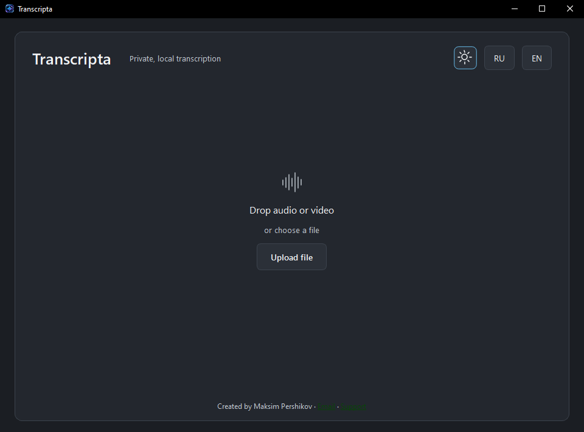
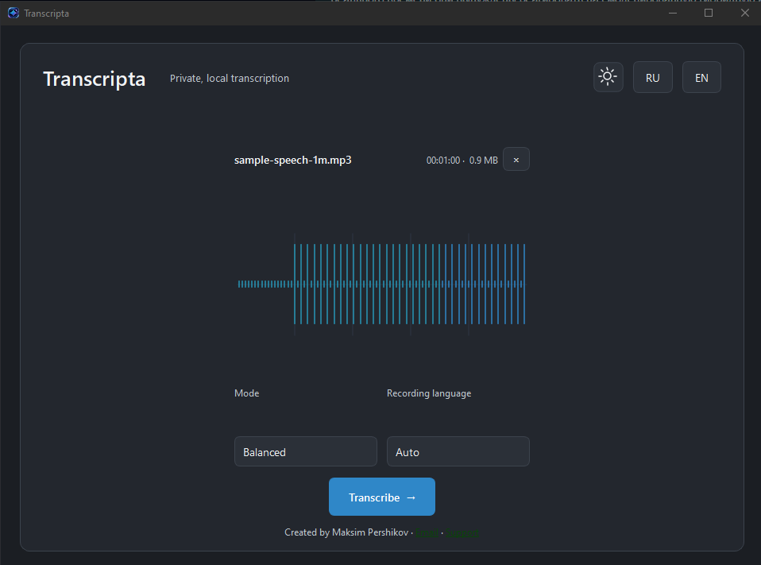
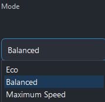
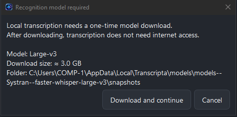
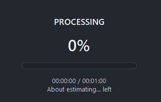
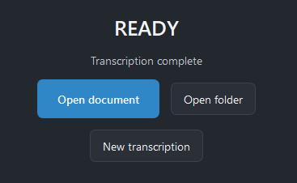

# Transcripta

**Transcripta 1.0.0** is a lightweight Windows desktop application for private, local audio and video transcription.

Drop in a recording, choose a performance mode and recording language, and Transcripta creates a DOCX document on your computer. Transcription is powered locally by faster-whisper; your media is not uploaded to a transcription service.

## What it looks like

Transcripta uses a compact single-screen workflow with **Graphite** and **Pearl** themes, Russian and English UI, drag-and-drop input, an audio waveform preview, clear processing progress, and a simple ready screen with direct access to the generated document and its folder.

The interface has four straightforward states:

**Drop file → Configure → Process → Open DOCX**

## Features

- Local audio and video transcription on Windows x64
- NVIDIA CUDA acceleration on supported GPUs
- faster-whisper with **Large-v3**, **Medium**, and **Small** model support
- **Eco**, **Balanced**, and **Maximum Speed** performance modes
- Automatic hardware-aware model policy
- Recording-language selection, including automatic detection
- Drag and drop and standard file picker
- Audio waveform preview before transcription
- MP3, WAV, M4A, FLAC, OGG, OPUS, MP4, MKV, MOV and WebM input
- DOCX-only output with duplicate-safe filenames
- **Open document**, **Open folder**, and **New transcription** actions after completion
- Russian and English interface
- Graphite and Pearl themes with persistent theme selection
- Resumable local model download with real progress and cancellation
- Offline transcription after the required model has been downloaded
- No account, telemetry, or cloud transcription

## Performance modes

Transcripta exposes three simple modes instead of technical inference settings:

| Mode | Purpose |
| --- | --- |
| **Eco** | Reduces resource pressure and preserves CPU/VRAM headroom |
| **Balanced** | Default general-purpose mode with a balance of quality and system responsiveness |
| **Maximum Speed** | Prioritizes transcription throughput |

On CUDA systems, the application selects its model according to available GPU memory. The current automatic policy uses **Large-v3 on the 12 GB+ VRAM class** and **Medium on lower-memory CUDA systems**. CPU fallback is also supported. Exact compute precision and chunking are selected internally by the application.

## First run

The recognition model is not embedded in the installer.

When a required model is missing, Transcripta shows a one-time download dialog with:

- model name;
- approximate download size;
- local model folder;
- download/cancel controls.

For Large-v3, the download is approximately **3 GB**. Once a valid model is stored locally, it is reused and transcription can run without an internet connection.

## Privacy

Transcripta is designed around local processing.

Your source audio/video and generated DOCX are processed on your computer. The application does not send recordings to a transcription API and does not use telemetry.

Internet access is needed only when a required recognition model must be downloaded.

## Installation

1. Download **Transcripta-1.0.0-Windows-x64-Setup.exe** from the [Releases](../../releases) page.
2. Run the installer.
3. Start **Transcripta**.
4. Drop an audio/video file into the window or click **Upload file**.
5. Choose the performance mode and recording language.
6. Click **Transcribe**.
7. When processing is complete, open the generated DOCX directly from Transcripta.

## System requirements

- Windows 10 or Windows 11, x64
- Sufficient free disk space for the application, local recognition model, source media and DOCX output
- NVIDIA GPU recommended for CUDA acceleration
- A current NVIDIA driver for GPU inference

**12 GB+ VRAM is recommended for the automatic Large-v3 policy.** Systems with less VRAM use the supported lower-memory model policy. CPU processing is available when CUDA cannot be used, but is slower.

The packaged application does not require users to install the full CUDA Toolkit separately.

## Screenshots

### Start

### File ready for transcription

### Performance modes

### Local model download

### Processing

### Ready

The screenshots show the final 1.0 workflow: **Drop file → Configure → Process → Open DOCX**. Graphite and Pearl themes are both included.

## Output

Transcripta intentionally keeps export simple: **DOCX only**.

The application creates safe duplicate names rather than silently overwriting an existing document.

## Documentation

- [Installation](docs/INSTALLATION.md)
- [GPU on Windows](docs/GPU_WINDOWS.md)
- [Models](docs/MODELS.md)
- [Troubleshooting](docs/TROUBLESHOOTING.md)
- [Development](docs/DEVELOPMENT.md)

## Author & support

Created by **Maksim Pershikov**

- Email: [tempchar1@outlook.com](mailto:tempchar1@outlook.com)
- Support: [Lava](https://app.lava.top/tempchar)

## Version

Current release: **1.0.0**
