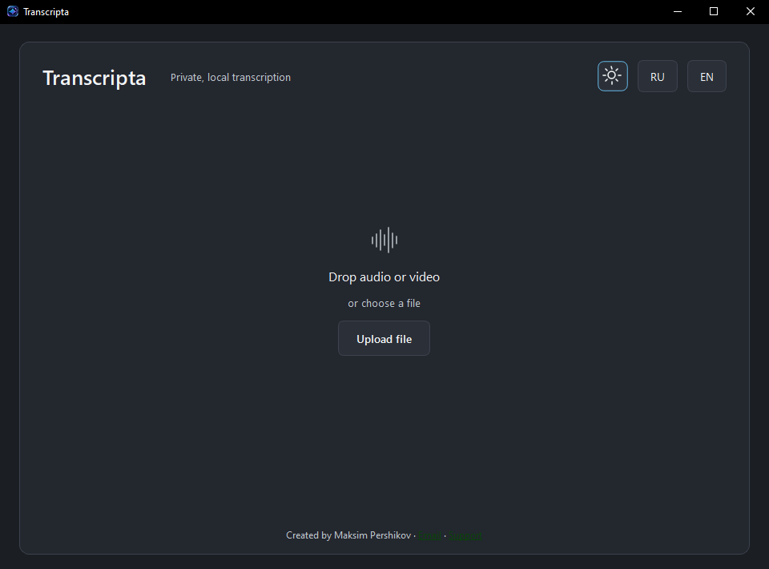
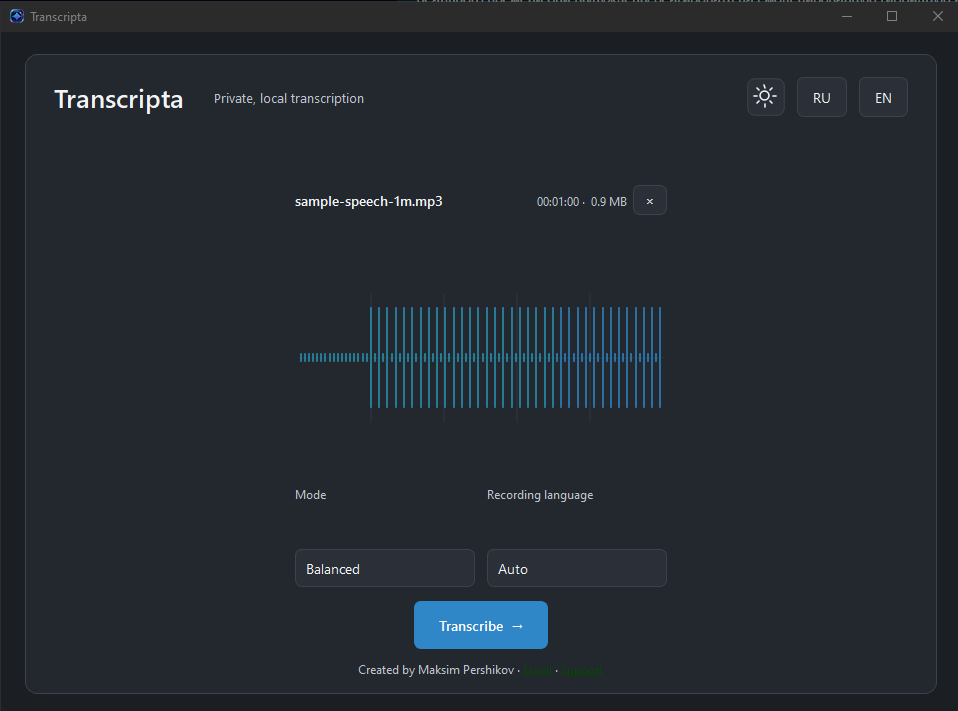
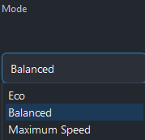
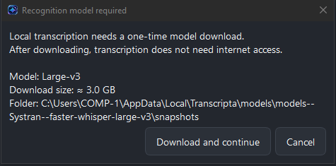
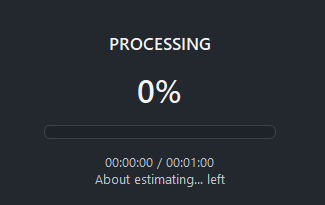
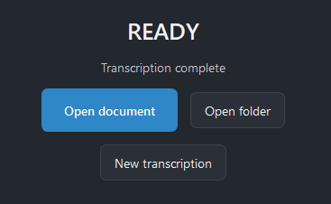

[**English**](README.md) | **Русский**

# Transcripta — приватная локальная ИИ-транскрибация для Windows

**Transcripta 1.0.0** — быстрое настольное приложение с упором на конфиденциальность для локальной транскрибации аудио и видео в Windows 10/11.

Добавьте запись, выберите режим производительности и язык — Transcripta создаст DOCX-документ локально на вашем компьютере. Распознавание речи работает на базе **faster-whisper / Whisper** с ускорением NVIDIA CUDA на поддерживаемых видеокартах. Ваши записи не загружаются в облачный сервис транскрибации.

## Как это выглядит

Transcripta использует компактный одноэкранный рабочий процесс с темами **Graphite** и **Pearl**, русским и английским интерфейсом, drag-and-drop, предпросмотром звуковой волны, понятным прогрессом обработки и простым финальным экраном с быстрым доступом к готовому документу и его папке.

Интерфейс состоит из четырёх понятных этапов:

**Добавить файл → Настроить → Обработать → Открыть DOCX**

## Возможности

- Локальная транскрибация аудио и видео в Windows x64
- Ускорение NVIDIA CUDA на поддерживаемых GPU
- faster-whisper с поддержкой моделей **Large-v3**, **Medium** и **Small**
- Режимы производительности **Eco**, **Balanced** и **Maximum Speed**
- Автоматический выбор модели с учётом оборудования
- Выбор языка записи, включая автоматическое определение
- Drag & drop и стандартный выбор файла
- Предпросмотр звуковой волны перед транскрибацией
- Входные форматы MP3, WAV, M4A, FLAC, OGG, OPUS, MP4, MKV, MOV и WebM
- Вывод только в DOCX с безопасным созданием имён дубликатов
- Действия **Открыть документ**, **Открыть папку** и **Новая транскрибация** после завершения
- Русский и английский интерфейс
- Темы Graphite и Pearl с сохранением выбранной темы
- Возобновляемая локальная загрузка модели с реальным прогрессом и отменой
- Офлайн-транскрибация после загрузки необходимой модели
- Без учётной записи, телеметрии и облачной транскрибации

## Режимы производительности

Вместо технических параметров инференса Transcripta предлагает три простых режима:

| Режим | Назначение |
| --- | --- |
| **Eco** | Снижает нагрузку и сохраняет запас ресурсов CPU/VRAM |
| **Balanced** | Режим по умолчанию: баланс качества и отзывчивости системы |
| **Maximum Speed** | Приоритет максимальной скорости транскрибации |

На системах с CUDA приложение выбирает модель в зависимости от доступной видеопамяти. Текущая автоматическая политика использует **Large-v3 при 12 ГБ+ VRAM** и **Medium на CUDA-системах с меньшим объёмом памяти**. Поддерживается и работа на CPU. Точная вычислительная точность и разбиение на фрагменты выбираются приложением автоматически.

## Первый запуск

Модель распознавания не встроена в установщик.

Если необходимая модель отсутствует, Transcripta показывает однократное окно загрузки с информацией:

- название модели;
- примерный размер загрузки;
- локальная папка модели;
- кнопки загрузки и отмены.

Для Large-v3 объём загрузки составляет примерно **3 ГБ**. После сохранения корректной модели локально она используется повторно, и транскрибация может выполняться без подключения к интернету.

## Конфиденциальность

Transcripta изначально рассчитана на локальную обработку.

Исходные аудио/видеофайлы и созданные DOCX обрабатываются на вашем компьютере. Приложение не отправляет записи в API транскрибации и не использует телеметрию.

Доступ к интернету требуется только для загрузки необходимой модели распознавания.

## Установка

1. Скачайте **Transcripta-1.0.0-Windows-x64-Setup.exe** со страницы [Releases](../../releases).
2. Запустите установщик.
3. Запустите **Transcripta**.
4. Перетащите аудио/видеофайл в окно или нажмите **Загрузить файл**.
5. Выберите режим производительности и язык записи.
6. Нажмите **Транскрибировать**.
7. После завершения обработки откройте созданный DOCX прямо из Transcripta.

## Системные требования

- Windows 10 или Windows 11, x64
- Достаточно свободного места для приложения, локальной модели распознавания, исходного медиафайла и DOCX
- NVIDIA GPU рекомендуется для ускорения CUDA
- Актуальный драйвер NVIDIA для работы на GPU

**Для автоматического выбора Large-v3 рекомендуется 12 ГБ+ VRAM.** Системы с меньшим объёмом видеопамяти используют поддерживаемую политику для менее требовательных моделей. Если CUDA недоступна, возможна обработка на CPU, но она будет медленнее.

Упакованное приложение не требует отдельной установки полного CUDA Toolkit.

## Скриншоты

### Старт

### Файл готов к транскрибации

### Режимы производительности

### Загрузка локальной модели

### Обработка

### Готово

Скриншоты показывают финальный рабочий процесс версии 1.0: **Добавить файл → Настроить → Обработать → Открыть DOCX**. Включены обе темы — Graphite и Pearl.

## Результат

Transcripta намеренно оставляет экспорт простым: **только DOCX**.

Приложение создаёт безопасные имена дубликатов вместо незаметной перезаписи существующего документа.

## Документация

- [Установка](docs/INSTALLATION.md)
- [GPU в Windows](docs/GPU_WINDOWS.md)
- [Модели](docs/MODELS.md)
- [Устранение неполадок](docs/TROUBLESHOOTING.md)
- [Разработка](docs/DEVELOPMENT.md)

## Автор и поддержка

Создано **Maksim Pershikov**

- Email: [tempchar1@outlook.com](mailto:tempchar1@outlook.com)
- Поддержать: [Lava](https://app.lava.top/tempchar)

## Версия

Текущая версия: **1.0.0**
